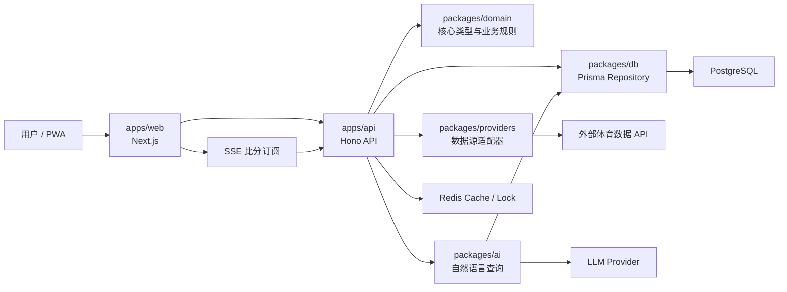
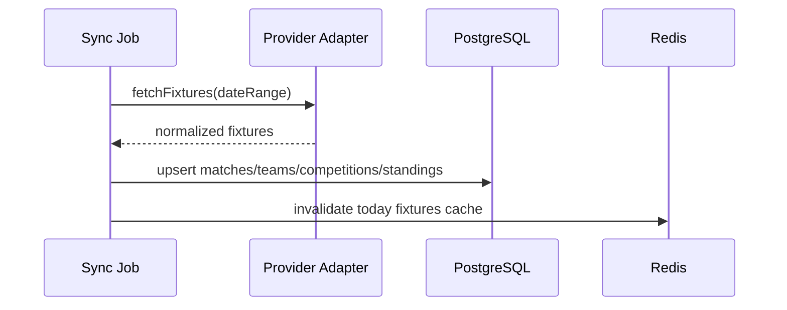
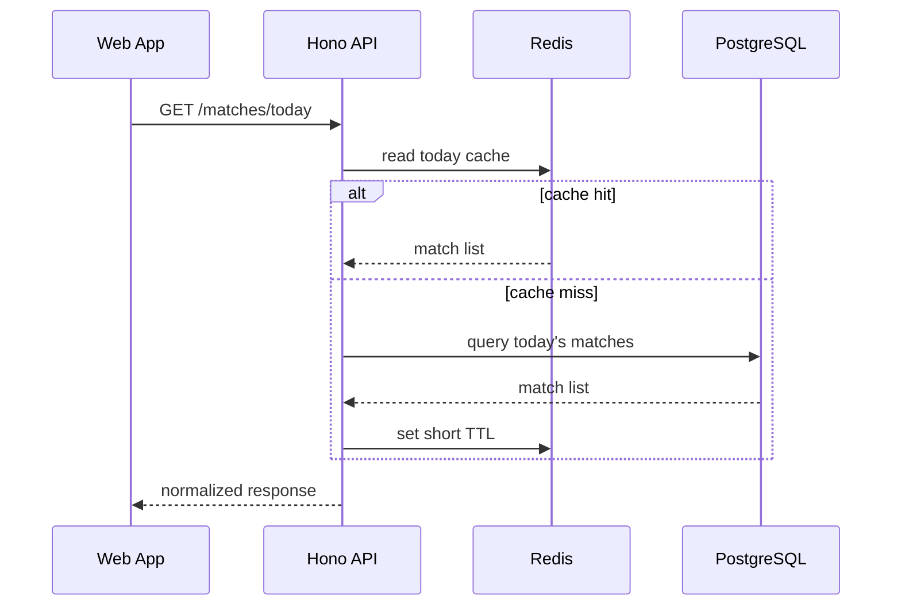
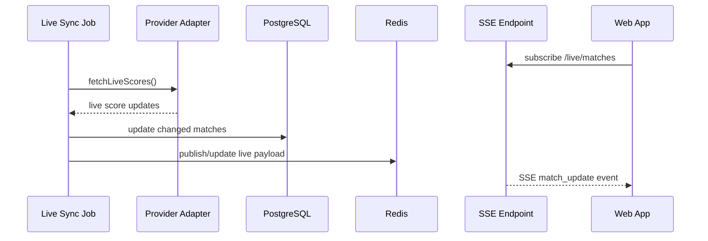
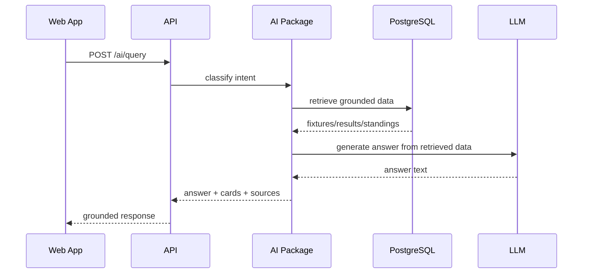

# OpenScore 架构设计

更新时间：2026-06-29

## 1. 架构目标

OpenScore 第一阶段架构目标：

- 快速交付 MVP
- 保持前后端类型一致
- 数据源可替换
- 支持实时比分更新
- 支持 AI 查询但不让 AI 编造事实
- 支持本地自建和云端部署
- 保持模块边界，后续可拆服务

## 2. 总体架构



第一阶段是模块化单体，不是微服务。`apps/web` 和 `apps/api` 可以独立启动，但共享 `packages/*`。

## 3. Monorepo 目录规划

```text
.
├── apps
│   ├── web
│   │   ├── app
│   │   ├── components
│   │   ├── features
│   │   └── lib
│   └── api
│       ├── src
│       │   ├── routes
│       │   ├── services
│       │   ├── middleware
│       │   ├── jobs
│       │   └── server.ts
├── packages
│   ├── domain
│   │   ├── models
│   │   ├── enums
│   │   └── rules
│   ├── db
│   │   ├── prisma
│   │   ├── repositories
│   │   └── client.ts
│   ├── providers
│   │   ├── core
│   │   ├── football-data
│   │   ├── thesportsdb
│   │   └── openfootball
│   ├── ai
│   │   ├── intents
│   │   ├── retrieval
│   │   └── answer
│   └── config
│       ├── env
│       └── eslint
├── docker-compose.yml
├── docs
└── pnpm-workspace.yaml
```

## 4. 模块边界

### 4.1 apps/web

职责：

- 页面路由
- 移动端 UI
- 收藏交互
- 调用 OpenScore API
- SSE 订阅
- PWA 配置

禁止：

- 直接访问数据库
- 直接调用第三方体育数据源
- 在页面里写 provider 特化逻辑

### 4.2 apps/api

职责：

- 对外产品 API
- 调用 service/repository/provider
- SSE 推送
- 同步任务入口
- AI 查询入口
- 错误码和响应格式统一

禁止：

- 把外部 provider 原始 payload 直接返回给前端
- 在 route handler 里写复杂业务逻辑

### 4.3 packages/domain

职责：

- 核心领域模型
- 枚举
- 状态流转规则
- 统一 ID 和时间语义

示例：

- `MatchStatus`
- `Sport`
- `CompetitionType`
- `StandingRule`
- `ProviderCode`

### 4.4 packages/db

职责：

- Prisma schema
- migration
- repository
- seed

原则：

- repository 返回 domain model 或 DTO
- 不向上层暴露 Prisma 原始复杂查询细节

当前已实现：

- `SportsRepository` 接口
- `createInMemorySportsRepository()`，用于 Docker/PostgreSQL 尚未准备好时的本地同步和查询验证
- `createPrismaSportsRepository()`，通过 Prisma 7 driver adapter 接入 PostgreSQL
- 初始 migration：`packages/db/prisma/migrations/20260629182000_init/migration.sql`
- mock seed：`pnpm db:seed`

### 4.5 packages/providers

职责：

- 外部数据源 SDK/HTTP 调用
- provider payload 标准化
- provider rate limit
- provider attribution

所有 provider 必须实现统一接口。

当前已实现：

- `SportsDataProvider` 接口
- `createSportsDataProvider()` 工厂
- `mock` provider
- `football_data` provider 适配器，基于 football-data.org v4 HTTP API

### 4.6 packages/ai

职责：

- 意图识别
- 数据检索计划
- 回答生成
- 来源和更新时间附加

禁止：

- 未检索数据库就直接回答比分
- 对未来比赛做博彩式推荐

## 5. 核心数据流

### 5.1 赛程同步



### 5.2 用户查看今日比赛



### 5.3 进行中比分更新



### 5.4 AI 查询



当前实现是确定性 grounded MVP：`POST /ai/query` 会检索今日比赛、进行中比赛和积分榜，按球队状态/进行中比赛/今日赛程做简单意图路由，返回中文回答、相关比赛卡片、数据源和更新时间。LLM provider 后续接入，但仍必须使用同一套结构化检索结果作为事实来源。

## 6. API 设计基线

MVP REST API：

```text
GET  /health
GET  /sports
GET  /competitions
GET  /competitions/:id/standings
GET  /matches/today
GET  /matches
GET  /matches/:id
GET  /teams/:id
GET  /teams/:id/form
GET  /live/matches/events
GET  /sync/status
POST /sync/run
POST /favorites/teams
DELETE /favorites/teams/:teamId
POST /ai/query
```

统一响应结构：

```json
{
  "data": {},
  "meta": {
    "source": "openscore",
    "updatedAt": "2026-06-28T00:00:00.000Z"
  }
}
```

错误响应：

```json
{
  "error": {
    "code": "PROVIDER_RATE_LIMITED",
    "message": "Data provider is temporarily rate limited."
  }
}
```

## 7. 领域模型基线

第一阶段核心实体：

- Sport
- Competition
- Season
- Team
- Venue
- Match
- MatchEvent
- Standing
- TeamForm
- Favorite
- ProviderSource
- SyncJobRun
- AiQueryLog

关键原则：

- 内部 ID 与 provider ID 分离
- 所有时间统一存 UTC
- 展示层再按用户时区转换
- provider 原始 payload 可存 JSONB 用于排错
- 同一场比赛允许多个 provider mapping

## 8. 数据源适配器接口

Provider adapter 的概念接口：

```ts
export interface SportsDataProvider {
  code: ProviderCode
  fetchCompetitions(): Promise<NormalizedCompetition[]>
  fetchFixtures(input: FixtureQuery): Promise<NormalizedMatch[]>
  fetchLiveScores(input: LiveScoreQuery): Promise<NormalizedMatchUpdate[]>
  fetchStandings(input: StandingQuery): Promise<NormalizedStanding[]>
  fetchTeam(input: TeamQuery): Promise<NormalizedTeam | null>
}
```

适配器必须做：

- 请求重试
- 限流处理
- 字段标准化
- provider attribution
- 错误映射

## 9. 缓存策略

当前 API 已有内存 TTL cache、Redis cache adapter、内存 sync lock 和 Redis sync lock。默认本地/CI 使用内存 cache 与内存锁；Docker Compose 默认使用 Redis cache 与 Redis 锁。SSE fanout 仍是后续工作。

| 数据 | TTL | 说明 |
|---|---:|---|
| 今日比赛 | 30-120 秒 | 根据是否有进行中比赛动态调整 |
| 积分榜 | 5-30 分钟 | 比赛结束后主动失效 |
| 球队详情 | 1-24 小时 | 队伍基础信息较冷 |
| 近期状态 | 5-30 分钟 | 依赖最近赛果 |
| AI 查询结果 | 30-300 秒 | 只缓存可复用、安全的问题 |

## 10. 配置与环境变量

环境变量统一通过 `packages/config` 校验。

基础变量：

```text
NODE_ENV
WEB_PUBLIC_BASE_URL
API_BASE_URL
DATABASE_URL
REDIS_URL
SPORTS_PROVIDER
FOOTBALL_DATA_API_KEY
FOOTBALL_DATA_BASE_URL
FOOTBALL_DATA_COMPETITIONS
THESPORTSDB_API_KEY
OPENAI_API_KEY
```

原则：

- 缺少必需变量时启动失败
- 前端只暴露 `NEXT_PUBLIC_*` 或等价公开变量
- API key 不进入前端包

## 11. 可观测性

MVP 至少记录：

- Provider 请求耗时
- Provider 错误率
- 同步任务成功/失败
- 比赛更新时间
- AI 查询是否有检索数据
- API 慢请求

日志先用结构化 JSON，后续再接 OpenTelemetry。

## 12. 安全与合规

基础原则：

- 不存用户敏感信息，MVP 收藏先本地化
- 不展示博彩引导
- 不做投注推荐
- 外部 API key 只在服务端使用
- 保留数据来源和更新时间
- 对 AI 回答做事实来源约束

## 13. 演进路径

### Stage 1：文档和原型

- 确认技术栈
- 建 monorepo
- mock 数据 UI

### Stage 2：真实数据 MVP

- 接入第一个 provider
- 落库
- 今日比赛/积分榜/球队页可用

### Stage 3：实时与 AI

- live sync
- SSE
- AI 查询

### Stage 4：开源可自建

- Docker Compose
- seed 数据
- 部署文档
- 贡献指南

## 14. 第一版架构决策

当前确认：

- 采用 pnpm monorepo
- 采用 Next.js App Router 做 Web/PWA
- 采用 Hono 做 API
- 采用 PostgreSQL + Prisma 做主数据层
- 采用 Redis 做缓存、锁和热数据
- 采用 SSE 做比分实时更新
- 采用 provider adapter 隔离外部数据源
- AI 回答必须基于结构化检索数据

当前 Web 已实现：

- `/` 今日比赛、积分榜、球队状态
- `/` 自然语言查询面板和 grounded 回答展示
- `/teams/[id]` 球队详情、近期状态、相关比赛

当前 API 已实现：

- mock provider 和 football-data provider 选择
- repository 读写抽象、内存 repository 和 PostgreSQL repository
- 内存 TTL cache 和 Redis cache adapter
- 内存 sync lock 和 Redis sync lock
- 手动同步任务状态：`GET /sync/status`、`POST /sync/run`
- 确定性 AI 查询 MVP：`POST /ai/query`

当前部署已实现：

- `Dockerfile`
- `docker-compose.yml` 覆盖 Web、API、PostgreSQL、Redis，并通过 `db-init` 执行 migration/seed
- `docs/DEPLOYMENT.md` 简单自建部署指南
- `.github/workflows/ci.yml` 基础 CI 门禁

当前开源协作已实现：

- `CONTRIBUTING.md`
- GitHub issue templates
- Pull request template
